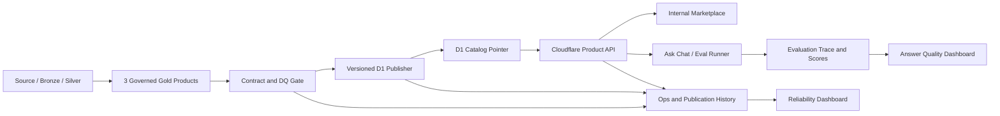

# ASK-Seoul 8월 13일 Final MVP 설계

## 1. 목적

ASK-Seoul을 단순 시각화 프로젝트가 아니라 다음 능력을 갖춘 governed data platform으로 증명한다.

1. Weather/Traffic Gold 제품을 안정적으로 생성한다.
2. 검증된 제품만 D1에 publication한다.
3. 내부 Marketplace와 안정적인 API를 통해 제품을 발견하고 조회한다.
4. 파이프라인과 데이터의 신뢰성을 운영 지표로 설명한다.
5. 페르소나·시나리오 기반 평가를 통해 답변의 정확성과 근거를 재현 가능하게 측정한다.

발표일은 2026-08-13이며, 구현 완료 목표는 2026-08-07이다. 8월 8일부터 발표 전까지는 장애 복구 검증, 회귀 테스트, 데이터 동결, 데모 리허설에 사용한다.

## 2. 성공 기준

발표 성공은 팀이 직접 통제하고 재현할 수 있는 내부 결과로 판정한다.

- 세 개의 Weather/Traffic 제품이 동일한 contract-to-serving 경로를 통과한다.
- 제품을 내부 Marketplace에서 발견하고 API로 조회할 수 있다.
- Reliability Dashboard가 실패·누락·지연·재시도 복구를 구분한다.
- Answer Quality Dashboard가 정답·검색·근거·거절·일관성을 평가한다.
- 통제된 publication 실패에도 last-known-good 데이터가 계속 조회된다.
- PlayMCP에 제출할 계약과 예제는 준비하되 외부 등록 승인은 성공 조건으로 삼지 않는다.

## 3. 범위

### 3.1 필수 데이터 제품

1. `gold_weather_place_current_outlook`
2. `gold_traffic_incident_x_weather_current_hourly`
3. `gold_traffic_flow_congestion_hotspots_hourly`

모든 제품은 다음 공통 계약을 갖는다.

- 안정적인 `product_id`
- 제품 소유자와 설명
- grain과 primary/uniqueness key
- schema version과 metric contract version
- freshness/SLO
- 지원 query parameter
- retention
- source/lineage
- validation rule

`hotspots` 제품은 이름과 실제 의미가 일치해야 한다. 모든 링크를 저장하고 순위만 붙이는 대신 시간·지역별로 계약에 명시된 bounded top-K를 제공하고 retention을 제한하는 방향을 권장한다. 이 의미 변경은 팀의 제품 계약 승인 후 적용한다.

### 3.2 필수 제품 화면

- 내부 Data Marketplace
- Lakehouse Reliability Dashboard
- Answer Quality Dashboard

### 3.3 배포 준비

- 안정적인 Product API
- PlayMCP 등록용 tool/API schema와 예제
- 향후 K-skill 기여가 가능한 공개 안전 계약

## 4. 명시적 비범위

- Chart Studio와 범용 분석 UI
- 임의 raw SQL 실행
- 전 도메인 공통 publisher 전환
- Kafka 기반 상시 이벤트 플랫폼
- 별도 metadata microservice
- 상시 실행되는 evaluation worker service
- PlayMCP 또는 K-skill 외부 승인
- 승인 없는 production D1 write

## 5. 권장 아키텍처

세 제품을 별도로 구현하지 않고 하나의 Governed Delivery Spine을 공유한다.



### 5.1 시스템 오브 레코드

- Iceberg `ops`: durable run/publication/quality history
- D1 `_catalog`: 현재 활성 publication과 read-optimized projection
- D1 versioned product tables: API가 읽는 serving snapshot
- evaluation result store: suite/run/case/trace/score 이력

D1 `_catalog`는 현재 상태를 위한 projection이며 실패 이력까지 보존하는 publication ledger로 사용하지 않는다.

### 5.2 현재 Kafka를 사용하지 않는 이유

현재는 세 개 제품, batch 중심 Airflow orchestration, 제한된 평가 실행량이 대상이다. Kafka를 도입하면 event schema, partition, offset, replay, dead-letter queue, broker monitoring, consumer idempotency까지 운영해야 한다. 현재 규모에서는 이 비용이 제공 가치보다 크다.

평가는 Airflow DAG 또는 재실행 가능한 Python runner로 수행한다. 향후 서로 독립적인 다수 consumer, 높은 이벤트 처리량, replay 요구가 생기면 다음 이벤트를 Kafka로 발행하는 구조로 확장할 수 있다.

- `pipeline.run.completed`
- `quality.check.completed`
- `publication.activated`
- `publication.failed`
- `evaluation.requested`
- `evaluation.completed`

Kafka를 도입하더라도 전달은 at-least-once를 기본 가정하고 `event_id`, `publication_id`, `eval_run_id` 기반으로 consumer를 멱등하게 설계한다.

## 6. 안전한 D1 Publication

현재 물리 테이블을 바로 교체하는 방식은 검증과 API smoke가 실패했을 때 bad version이 노출될 수 있다. 권장 상태 전이는 다음과 같다.

```text
CREATED
  -> LOADING
  -> VALIDATING
  -> CANDIDATE_READY
  -> SMOKE_PASSED
  -> ACTIVE

실패 시:
  -> FAILED
  -> candidate 폐기
  -> 기존 ACTIVE 유지
```

### 6.1 Publication 절차

1. 결정적인 `publication_id`와 version table name을 만든다.
2. 후보 버전 테이블에 데이터를 적재한다.
3. row count, schema hash, uniqueness, null, completeness를 검증한다.
4. 활성 pointer와 무관한 candidate 전용 경로로 API smoke를 수행한다.
5. catalog pointer를 원자적으로 새 publication으로 전환한다.
6. 이전 ACTIVE 버전을 제한된 기간 유지한다.
7. 전환 후 readback을 확인한다.
8. 실패 시 candidate만 정리하고 기존 ACTIVE를 유지한다.

### 6.2 멱등성

- 동일 producer evidence와 product version의 재실행은 같은 idempotency key를 사용한다.
- append/upsert 제품은 명시적 primary 또는 unique key를 갖는다.
- `INSERT OR REPLACE`에 실제 conflict target이 없는 상태를 허용하지 않는다.
- export orchestration run이 아니라 Gold producer evidence를 `source_run_id`로 기록한다.

## 7. Product API와 Marketplace

### 7.1 API 경계

외부 계약은 물리 table name이 아니라 stable `product_id`를 사용한다.

최소 API:

- `GET /catalog`
- `GET /products/{product_id}`
- `GET /products/{product_id}/data`
- 내부 전용 candidate smoke endpoint

요청은 다음을 강제한다.

- bounded limit
- deterministic order와 pagination
- 제품별 allowlist parameter
- 시간·지역·metric validation
- 일관된 response envelope
- `request_id`, `publication_id`, `as_of`, source trace
- 내부 예외와 SQL을 노출하지 않는 오류 응답

### 7.2 Marketplace 역할

Marketplace는 BI 화면이 아니라 제품 계약과 API usability를 제공한다.

- 제품 이름과 설명
- 소유자와 도메인
- grain과 schema/metric
- freshness와 현재 publication
- reliability 상태
- request/response 예제
- API test console
- lineage와 품질 화면 연결

Chart Studio는 navigation과 최종 배포 범위에서 제거한다. 발표 전에는 대규모 삭제보다 feature/navigation gating을 우선하여 회귀 위험을 낮춘다.

## 8. Reliability Dashboard

### 8.1 Expected-run 기반 상태

성공률의 분모는 관측된 실행이 아니라 예정된 실행이다. 그래야 Airflow run 자체가 생성되지 않은 silent failure가 드러난다.

잔디 상태:

- `ON_TIME_SUCCESS`: 정시 성공과 critical contract 통과
- `RECOVERED_SUCCESS`: 재시도 또는 backfill 후 복구
- `LATE_OR_DEGRADED`: 지연 또는 non-critical 품질 저하
- `FAILED_OR_MISSING`: 실패 또는 expected run 누락
- `NOT_SCHEDULED`: 실행 예정 없음

각 셀에서 다음으로 drill-down할 수 있어야 한다.

- DAG/product
- logical interval
- run/attempt
- producer evidence
- contract/DQ 결과
- error category
- detected/recovered time
- publication 영향

### 8.2 MVP 지표

필수:

- expected-run success/failure rate
- end-to-end latency
- freshness
- retry/recovery rate
- volume/completeness
- schema contract
- critical null/uniqueness
- SLO와 error budget

조건부:

- MTTD/MTTR은 `detected_at`, `acknowledged_at`, `recovered_at`을 가진 incident lifecycle 이후 계산한다.
- throughput은 row count만으로 해석하지 않고 product별 정상 grain과 함께 표시한다.
- lineage는 scalar score가 아니라 source-to-product trace와 blast radius로 제공한다.

## 9. Answer Quality Dashboard

### 9.1 평가 단위

평가 케이스는 다음 필드를 갖는다.

- `eval_case_id`
- `suite_version`
- `persona_id`
- `paraphrase_group_id`
- question
- answerable flag
- expected `product_id`, metric, normalized arguments
- expected normalized result와 tolerance
- metric contract version
- immutable `publication_id` 또는 source snapshot
- `as_of`

Ground truth를 mutable current table에만 연결하지 않는다.

### 9.2 실행

Airflow evaluation DAG 또는 Python runner가 다음을 수행한다.

1. versioned evaluation suite 로딩
2. 기존 constrained Ask Chat/Product API 호출
3. tool call, argument, evidence, response 수집
4. deterministic scorer 실행
5. 필요한 항목만 LLM-as-judge 실행
6. latency, token, 오류와 함께 결과 저장
7. 실패 케이스를 멱등하게 재시도

### 9.3 지표

기계 채점:

- correctness
- expected product/metric retrieval
- argument correctness
- traceability
- correct abstention
- false-answer rate
- over-refusal
- persona/paraphrase semantic consistency

보조 LLM judge:

- groundedness/faithfulness
- claim-level hallucination
- answer relevance
- completeness

Judge 결과에는 provider/model, prompt/rubric version, 실행 시각과 근거를 기록한다. LLM judge 단독 결과는 release gate로 사용하지 않는다.

### 9.4 Trust Score

발표용 북극성 지표:

```text
Trust Score = correctness * (1 - false-answer rate) * faithfulness
```

분모:

- correctness: 전체 answerable case. 답할 수 있는데 거절한 경우 오답으로 처리한다.
- false-answer rate: 전체 unanswerable case 중 거절하지 않고 사실을 생성한 비율이다.
- faithfulness: 전체 검증 가능한 claim 중 source evidence로 지지되는 비율이다.

Trust Score 옆에 반드시 다음을 표시한다.

- 세 component 원점수
- 평가 case 수와 suite version
- domain/persona/question-type slice
- answer coverage와 over-refusal
- traceability failure

False-answer rate와 trace integrity는 composite로 상쇄되지 않는 별도 안전 gate다.

## 10. 파이프라인 안정화와 병행 전략

`weather_w2_canonical`이 contract와 missing data 문제로 불안정하므로 실제 publication과 ground truth 생성은 안정화 gate 이후 수행한다. 그러나 플랫폼 인터페이스 작업은 지금 병행한다.

### 10.1 지금 병행할 수 있는 작업

- product/API contract
- publication state와 ledger schema
- expected-run 상태 모델
- evaluation suite/trace schema
- Marketplace와 dashboard 구조
- failure-injection test 설계

### 10.2 안정화 이후 연결할 작업

- 최종 Gold contract freeze
- 실제 Gold-to-D1 publication
- immutable ground truth 생성
- SLO baseline
- 최종 E2E demo data freeze

### 10.3 핵심 upstream readiness gate

- critical dbt contract/test 통과
- 동일 입력 재실행 시 중복 없음
- 시간·지역 completeness 탐지
- 실패 후 backfill 성공
- 최소 세 번의 예정 실행 연속 성공 또는 24~48시간 burn-in
- failure category가 data/contract/infrastructure로 분류됨

13개 DAG 전체가 완벽할 필요는 없다. 세 필수 제품의 upstream DAG가 readiness gate를 충족해야 한다.

## 11. 실패와 복구 원칙

- Critical contract 위반은 publication을 차단한다.
- Optional 결손은 명시적 degraded 상태와 coverage를 남긴다.
- 원천 미도착을 성공 또는 값 `0`으로 변환하지 않는다.
- retry는 지수 backoff와 최대 횟수를 제한한다.
- retryable/non-retryable 오류를 구분한다.
- partial publication을 ACTIVE로 표시하지 않는다.
- 실패·재시도·복구는 동일 correlation identifier로 연결한다.
- API 장애와 데이터 freshness 장애를 별도 분류한다.
- 모든 backfill과 평가 재실행은 멱등해야 한다.

## 12. 구현 우선순위

### 7월 27~29일

- 핵심 Weather/Traffic pipeline 안정화 병행
- 세 제품 contract와 API 경계 확정
- publication ledger/state schema
- existing PR을 최신 `dev` 기준으로 재검증

### 7월 30일~8월 1일

- safe D1 publisher와 candidate validation
- stable product API
- Marketplace의 세 제품 연결

### 8월 2~4일

- expected-run/reliability mart
- 잔디와 error drill-down
- controlled failure와 last-good 검증

### 8월 5~7일

- evaluation fixture와 runner
- deterministic scorer
- Answer Quality Dashboard
- PlayMCP-ready schema/examples

### 8월 8~12일

- 회귀 테스트와 fault injection
- 데이터와 evaluation suite 동결
- 성능·비용 확인
- 발표 스크립트와 복구 데모 리허설

## 13. 발표 시나리오

1. Marketplace에서 세 제품과 계약을 확인한다.
2. API로 날씨/교통 데이터를 조회하고 publication/source evidence를 확인한다.
3. 정상 publication을 실행한다.
4. 통제된 품질 실패를 주입하고 bad candidate가 활성화되지 않음을 증명한다.
5. Reliability Dashboard에서 실패와 복구 과정을 확인한다.
6. answerable/unanswerable·persona/paraphrase 평가를 실행한다.
7. Trust Score와 false-answer/traceability gate를 확인한다.
8. 동일 API가 PlayMCP tool contract로 포장될 수 있음을 보여준다.

## 14. 최종 검증 체크리스트

- [ ] 세 제품 contract와 식별자가 동결되었다.
- [ ] product key와 idempotency key가 명시되었다.
- [ ] bad candidate가 ACTIVE가 되지 않는다.
- [ ] last-known-good가 publication 실패 중에도 조회된다.
- [ ] expected run 누락이 잔디에서 실패로 보인다.
- [ ] retry recovery와 clean success가 구분된다.
- [ ] ground truth가 immutable evidence에 연결된다.
- [ ] 잘못된 product/metric에서 우연히 같은 숫자가 나온 경우 retrieval 실패로 처리한다.
- [ ] 데이터가 없을 때 false answer를 탐지한다.
- [ ] 평가 결과가 suite/judge/metric contract version을 보존한다.
- [ ] 데모가 반복 가능한 명령과 fixture로 실행된다.
